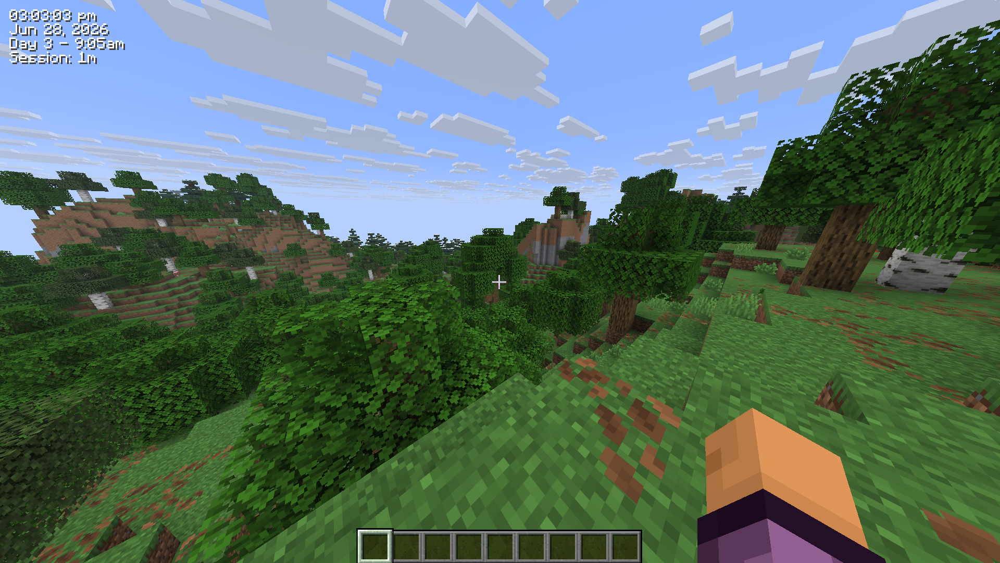

# RealClockHUD

Displays the real-life system time as a HUD overlay in Minecraft.



---

## Download

[](https://modrinth.com/mod/realclockhud)
[](https://www.curseforge.com/minecraft/mc-mods/realclockhud)
[](https://github.com/loganmharkness/realclockhud/releases/latest)

---

## Features

- Real-life clock displayed as an in-game HUD overlay
- 12-hour and 24-hour format toggle
- Optional seconds display
- Real-life date display (e.g. `Jun 28, 2026`)
- In-game time display (e.g. `Day 42 - 6:30am`)
- Session timer showing how long you've been playing (e.g. `Session: 1h 23m`)
- Configurable corner positioning (top-left, top-right, bottom-left, bottom-right)
- X/Y offset for fine-tuned placement
- Custom text color (hex)
- Optional background box
- Optional text shadow
- Keybind to toggle visibility (default: `K`, rebindable in Controls)
- `/realclock` commands for all settings
- Self-healing config - invalid or missing values are corrected and re-saved automatically
- Hides during F1/F3 and screenshots
- Updated for 26.2
---

## Settings/Commands

All settings are stored in `.minecraft/config/realclock.json` and can be edited manually.
The config is self-healing - any invalid values will be reset to defaults automatically on next launch.

You can also change any setting using the `/realclock` command - no need to edit the config file directly. Changes take effect immediately and are saved automatically.

The clock can also be toggled with the **K** keybind (rebindable in Options > Controls).

| Setting | Command | Default | Description |
|---|---|---|---|
| `24h` | `/realclock 24h true` | `false` | Use 24hr time format instead of 12hr |
| `background` | `/realclock background true` | `true` | Show a dark box behind the clock |
| `color` | `/realclock color #FF0000` | `#FFFFFF` | Text color as a hex value |
| `corner` | `/realclock corner top-left` | `top-right` | Clock position - `top-left`, `top-right`, `bottom-left`, `bottom-right` |
| `date` | `/realclock date true` | `false` | Show the real-life date below the clock |
| `gametime` | `/realclock gametime true` | `false` | Show the in-game day and time of day |
| `offsetx` | `/realclock offsetx 8` | `4` | Horizontal nudge in pixels from the corner |
| `offsety` | `/realclock offsety 8` | `4` | Vertical nudge in pixels from the corner |
| `scale` | `/realclock scale 1.5` | `1.0` | Text scale - `1.0` is normal, `2.0` is double size |
| `seconds` | `/realclock seconds true` | `false` | Show seconds alongside the time |
| `sessiontimer` | `/realclock sessiontimer true` | `false` | Show how long you've been in the current session |
| `shadow` | `/realclock shadow true` | `true` | Render a drop shadow behind the text |
| `toggle` | `/realclock toggle` | `true` | Whether the clock is currently visible |
## Configuration

Config file is created automatically at `.minecraft/config/realclock.json` on first launch.

```json
{
  "visible": true,
  "corner": "TOP_RIGHT",
  "use24Hour": false,
  "showSeconds": false,
  "color": 16777215,
  "scale": 1.0,
  "showDate": false,
  "showGameTime": false,
  "showSessionTimer": false,
  "showBackground": true,
  "textShadow": true,
  "offsetX": 4,
  "offsetY": 4
}
```

`color` is stored as a decimal integer. `16777215` = `#FFFFFF` (white).

---
