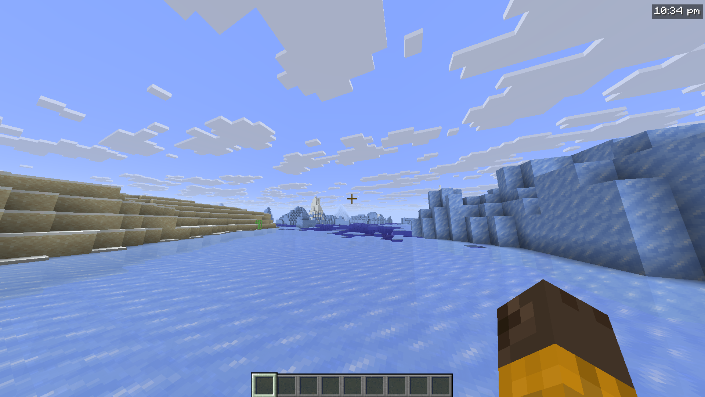

# RealClock

Displays the real-life system time as a HUD overlay in Minecraft.



---

## Features

- Real-life clock displayed as an in-game HUD overlay
- 12-hour and 24-hour format toggle
- Optional seconds display
- Configurable corner positioning (top-left, top-right, bottom-left, bottom-right)
- X/Y offset for fine-tuned placement
- Custom text color (hex)
- Optional background box
- Optional text shadow
- Keybind to toggle visibility (default: `K`, rebindable in Controls)
- `/realclock` commands for all settings
- Self-healing config - invalid or missing values are corrected and re-saved automatically
- Hides during F1/F3 and screenshots

---

## Configuration

All settings are stored in `.minecraft/config/realclock.json` and can be edited manually.
The config is self-healing - any invalid values will be reset to defaults automatically on next launch.

| Setting | Default | Description |
|---|---|---|
| `24h` | `false` | Use 24hr time format instead of 12hr |
| `background` | `true` | Show a dark box behind the clock |
| `color` | `#FFFFFF` | Text color as a hex value |
| `corner` | `top-right` | Clock position - `top-left`, `top-right`, `bottom-left`, `bottom-right` |
| `offsetx` | `4` | Horizontal nudge in pixels from the corner |
| `offsety` | `4` | Vertical nudge in pixels from the corner |
| `scale` | `1.0` | Text scale - `1.0` is normal, `2.0` is double size |
| `seconds` | `false` | Show seconds alongside the time |
| `shadow` | `true` | Render a drop shadow behind the text |
| `toggle` | `true` | Whether the clock is currently visible |

The clock can also be toggled in-game with the **K** keybind (rebindable in Options > Controls).

## Configuration

Config file is created automatically at `.minecraft/config/realclock.json` on first launch.

```json
{
  "visible": true,
  "corner": "TOP_RIGHT",
  "use24Hour": false,
  "showSeconds": false,
  "color": 16777215,
  "scale": 1.0,
  "showBackground": true,
  "textShadow": true,
  "offsetX": 4,
  "offsetY": 4
}
```

`color` is stored as a decimal integer. `16777215` = `#FFFFFF` (white).

---

## Installation

1. Install [Fabric Loader](https://fabricmc.net/use/)
2. Install [Fabric API](https://modrinth.com/mod/fabric-api)
3. Drop the RealClock `.jar` into your `mods` folder

---

## Compatibility

Client-side only. Works on any server including vanilla - the server never sees this mod.

- Minecraft: 1.21.1
- Fabric Loader: >= 0.18.4
- Fabric API: any
- Java: >= 25
